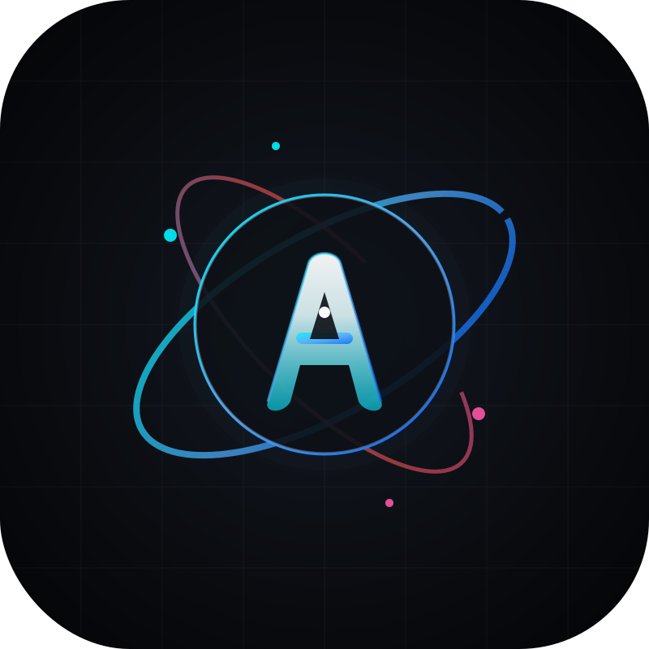

  

<h1 align="center">🚀 Auto-Submit CLI for Antigravity</h1>

  <a href="#vietnamese-vietnamese-version">Tiếng Việt</a> • 
  <a href="#english-english-version">English</a>

---

## 🇻🇳 Vietnamese (Vietnamese Version)

**Auto-Submit CLI** là một bộ công cụ siêu nhẹ, di động (portable) và tự động hóa hoàn toàn giúp tối ưu hóa luồng làm việc của bạn trong IDE Antigravity. Công cụ này tự động hóa việc phê duyệt các yêu cầu thực thi lệnh hệ thống (Command Execution) từ AI Agent, giải phóng bạn khỏi việc phải click chuột thủ công vào nút "Submit" mỗi khi agent muốn chạy lệnh.

Dự án đi kèm với một ứng dụng Khay hệ thống (System Tray) viết bằng C# cho phép bạn bật/tắt tính năng tự động phê duyệt chỉ với 1 cú click.

---

### 🌟 Tính năng nổi bật & Sự tối ưu vượt trội
1. **Tự động hóa hoàn toàn (Zero-Friction Installation)**: Chỉ cần chạy ứng dụng Tray lần đầu, nó sẽ tự động vá ngầm (patch) Antigravity và khởi động lại IDE. Không cần người dùng mở PowerShell hay gõ lệnh thủ công.
2. **Khắc phục triệt để Electron Sandbox**: Bản vá tự động vô hiệu hóa chế độ Sandbox của Electron cho preload script (`sandbox: false` in `utils.js`), mở khóa toàn bộ sức mạnh Node.js (`fs`, `path`, `os`) cho đoạn script vá lỗi chạy chính xác 100%.
3. **Bộ lắng nghe SPA thông minh (IIFE & MutationObserver)**: Bản vá sử dụng hàm tự chạy (IIFE) kết hợp với `MutationObserver` gắn thẳng vào thẻ gốc `<html>` (`document.documentElement`). Bất kể bạn đổi Session chat, đổi Project hay tạo hội thoại mới, tính năng tự động duyệt lệnh luôn phản hồi lập tức trong vài mili-giây.
4. **An toàn & Minh bạch 100%**:
   - **Không yêu cầu quyền Admin**: Việc đăng ký khởi động cùng Windows sử dụng Registry cục bộ (`HKCU:\Software\Microsoft\Windows\CurrentVersion\Run`), hoàn toàn không đòi hỏi quyền Admin cao nhất.
   - **Khóa đơn tiến trình (Mutex Single-Instance)**: Ứng dụng khay hệ thống sử dụng Mutex toàn cục, ngăn chặn triệt để việc mở nhiều cửa sổ/icon trùng lặp làm tốn tài nguyên máy tính.
   - **Chống rò rỉ bộ nhớ (GDI+ Memory Protection)**: Quá trình vẽ Icon động (Xanh khi bật, Xám khi tắt) được quản lý chặt chẽ bằng cách giải phóng (Dispose) các GDI+ handle ngay lập tức sau khi vẽ.
5. **Gỡ cài đặt sạch sẽ (Zero-Residual)**: Trình gỡ cài đặt khôi phục lại 100% tệp gốc `app.asar`, xóa sạch Registry khởi động và tệp cấu hình trung gian. Không để lại bất kỳ tập tin rác nào trên hệ thống của bạn.

---

### 📂 Cấu trúc dự án
Dự án được tối ưu tối giản theo triết lý "No Bloatware" chỉ với các tệp tin cốt lõi:
* 🖥 **`Program.cs`**: Mã nguồn C# điều khiển ứng dụng Khay hệ thống, vẽ icon động, quản lý Registry và cấu hình.
* 🛠 **`patcher.ps1`**: Kịch bản PowerShell thực hiện vá nhân Antigravity, vô hiệu hóa Sandbox Electron và tích hợp preload script.
* 🧹 **`uninstaller.ps1`**: Kịch bản PowerShell khôi phục Antigravity về trạng thái gốc, dọn dẹp hệ thống.
* 📜 **`preload_patch.js`**: Đoạn mã JavaScript vá lỗi tiêm ngầm vào Antigravity để lắng nghe và bấm duyệt nút "Submit".
* ⚙️ **`compile.bat`**: Nhấp đúp để tự động biên dịch lại `Program.cs` thành tệp thực thi `AutoAG_Tray.exe` siêu nhanh mà không cần cài đặt phần mềm nặng nề.
* 🚀 **`install_patch.bat` & `uninstall_patch.bat`**: Các phím tắt nhanh để chạy trình vá lỗi/gỡ lỗi bằng một click.
* 📦 **`AutoAG_Tray.exe`**: Ứng dụng khay hệ thống đã được biên dịch sẵn.

---

### 🚀 Hướng dẫn sử dụng
#### Bước 1: Khởi động hệ thống
Bạn chỉ cần click đúp vào **`AutoAG_Tray.exe`**:
* Ứng dụng sẽ tự động xuất hiện ở Khay hệ thống (System Tray) của Windows với biểu tượng hình tròn màu xanh ngọc lục bảo chữ **A**.
* Ứng dụng sẽ tự động thực hiện vá lỗi ngầm cho Antigravity (nếu chưa vá) và khởi động lại Antigravity trong tích tắc.

#### Bước 2: Bật/Tắt dễ dàng
* **Nhấp đúp vào biểu tượng Khay hệ thống** hoặc **Nhấp chuột phải -> Auto-Submit Enabled** để bật/tắt nhanh chế độ tự động duyệt.
  - 🟢 **Màu xanh ngọc**: Auto-Submit đang **Bật** (Các lệnh sẽ được phê duyệt tự động ngay lập tức).
  - 🔴 **Màu xám**: Auto-Submit đang **Tắt** (Mọi lệnh yêu cầu duyệt sẽ hiển thị hộp thoại chờ bạn bấm duyệt thủ công).
* **Khởi động cùng Windows**: Chọn **Run on Windows Startup** trong Menu chuột phải để công cụ tự khởi động mỗi khi bạn mở máy tính.

---

## 🇺🇸 English (English Version)

**Auto-Submit CLI** is an ultra-lightweight, 100% portable, and zero-friction automation utility designed to supercharge your workflow within the Antigravity IDE on Windows. It automates the tedious command-run approval flow from AI Agents, instantly clicking the "Submit" button whenever a command execution request arises.

The project features a C# System Tray background application that allows you to easily toggle the auto-submit feature on or off with a single click.

---

### 🌟 Core Highlights & Architectural Optimizations
1. **Zero-Friction Silent Installation**: Launching the Tray app automatically applies the patch under-the-hood and restarts the IDE if needed. No manual command-line execution or PowerShell interaction is required from the end user.
2. **Electron Sandbox Defeat**: The patcher automatically injects `sandbox: false` into the window's `webPreferences` inside `utils.js`. This disables the renderer process sandboxing, opening full Node.js API support (`fs`, `path`, `os`) for our preload script.
3. **SPA-Ready Smart Observer (IIFE & MutationObserver)**: The script runs instantly as an IIFE, observing mutations on the HTML root element (`document.documentElement`). It works seamlessly across routing navigations, workspace changes, and brand new chat sessions without reloading.
4. **100% Secure & Transparent**:
   - **No Administrator Privileges Required**: Writes to the local user Registry hive (`HKCU:\Software\Microsoft\Windows\CurrentVersion\Run`), enabling startup automation without requesting elevation.
   - **Single Instance Enforcement (Mutex)**: Utilizes a global C# system `Mutex` to prevent duplicate processes from launching and wasting resources.
   - **Memory Leak Protection (GDI+)**: The dynamic tray icon redrawing pipeline strictly disposes of GDI+ handles (`Icon`, `Graphics`, `Bitmap`) to ensure zero memory leaks over long sessions.
5. **Zero-Residual Clean Uninstall**: The uninstaller perfectly restores the pristine backup of `app.asar`, removes startup Registry entries, and wipes the settings folder cleanly.

---

### ⚙️ Usage Instructions
#### Step 1: Initial Setup
Double-click **`AutoAG_Tray.exe`**:
* The application will run silently in the Windows System Tray with a sharp teal circle icon containing the letter **A**.
* It immediately patches Antigravity in the background and restarts the IDE automatically.

#### Step 2: Custom Toggles
* **Double-click the Tray Icon** or **Right-click -> Auto-Submit Enabled** to toggle.
  - 🟢 **Teal green circle**: Auto-Submit is **ENABLED** (Commands are accepted instantly).
  - 🔴 **Dark grey circle**: Auto-Submit is **DISABLED** (Consent dialogs will appear and wait for your manual action).
* **Autostart with Windows**: Check **Run on Windows Startup** inside the right-click menu to have the tray app run automatically when your computer boots up.

---
*Developed with 💻 & ☕ for Antigravity Users.*
