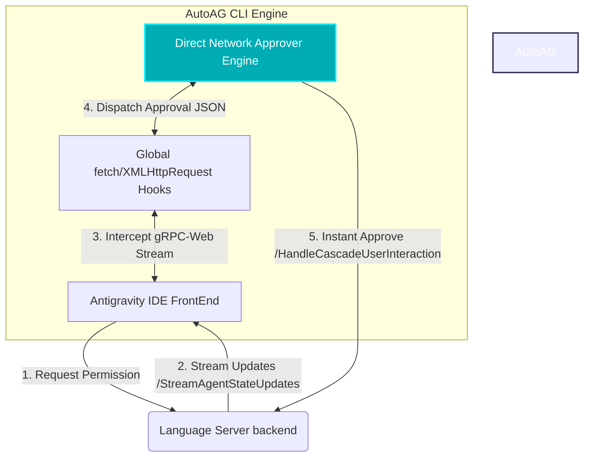

<p align="center">
  <a href="README.md"><b>🇺🇸 English Version</b></a> | 
  <a href="README.vi.md"><b>🇻🇳 Tiếng Việt</b></a>
</p>

<p align="center">
  
</p>

<h1 align="center">⚡ AutoAG CLI ⚡</h1>

<p align="center">
  <strong>Ultra-Fast Background Permission Auto-Approver for Antigravity IDE</strong>
</p>

<p align="center">
  
  
  
</p>

---

## 🌟 Core Features

| Feature | Legacy Solution (DOM Rotator) | New Solution (AutoAG gRPC-Web) |
| :--- | :---: | :---: |
| **Response Speed** | 🐢 5 ~ 10 seconds (Delay & Tab Switching) | ⚡ **< 1 millisecond** (Instantaneous!) |
| **UI Interference** | ⚠️ Screen flickering, active tab switching | 🍃 **100% Silent**, no tab switching, zero UI impact |
| **Background execution** | ❌ Paused when minimized or unfocused |  **Runs continuously in background** even if minimized |
| **Reliability** | 🔄 Prone to errors if the DOM structure changes | 🛡️ **Dual-Layer**: Network interception + DOM fallback |

---

## 🗺️ System Architecture



---

## 📂 Repository Structure

```text
AutoAG_CLI/
├── assets/                  # Image assets (LogoAG.png)
├── scripts/                 # Compilation, patching and installation scripts
├── src/                     # Source code
│   ├── patch/               # Network preloader patch (Javascript)
│   └── tray/                # Windows System Tray App (C#)
│       └── Resources/       # Built resolution icons (logo.ico, logo_disabled.ico)
├── install.bat              # One-click installer shortcut (Root)
├── uninstall.bat            # One-click uninstaller shortcut
└── AutoAG_Tray.exe          # Compiled Windows System Tray binary
```

---

## ⚡ Quick Start

### 1. Installation

> [!IMPORTANT]
> Make sure you have launched Antigravity IDE at least once before installing.

Run the shortcut script directly from the root folder:
* Double-click **`install.bat`** to automatically patch and activate AutoAG.

---

### 2. Control via Windows System Tray

Double-click **`AutoAG_Tray.exe`** to launch the administration icon in your Windows Taskbar corner:

| System Icon | Action Status | Description |
| :---: | :--- | :--- |
|  | **Active** | AutoAG is actively intercepting and auto-approving in `<1ms`! |
|  | **Disabled** | Autopilot paused. Reverts to default user prompt behavior. |

---

### 3. Uninstallation

Double-click **`uninstall.bat`** at the root of the project to completely restore the Antigravity IDE to its original, unpatched state.

---

<p align="center">
  Found a bug or want to suggest updates? Feel free to open an Issue or submit a Pull Request! ❤️
</p>
