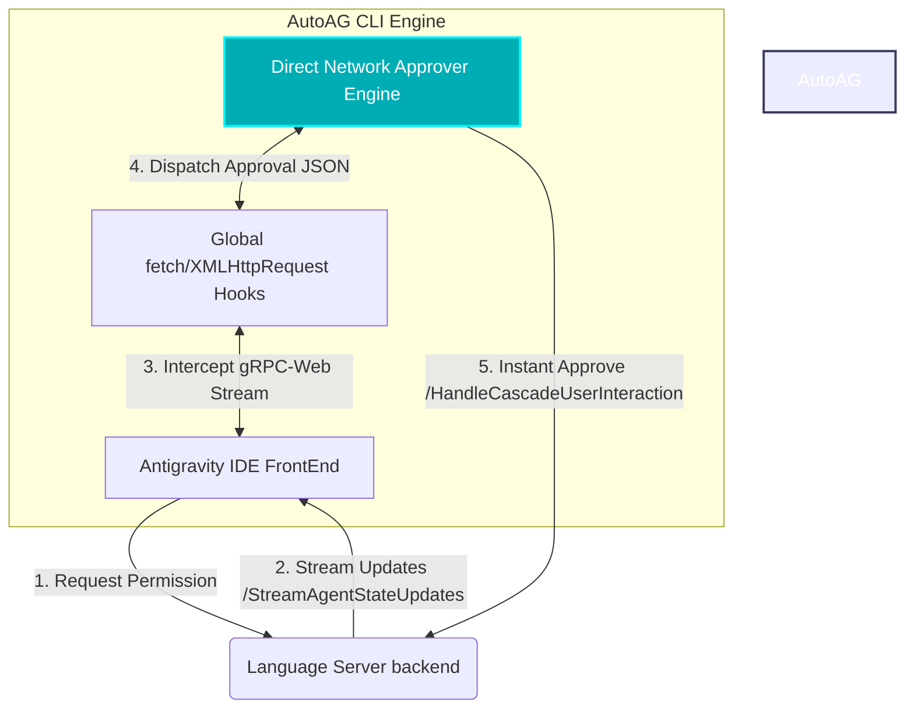

<p align="center">
  <a href="README.md"><b>🇺🇸 English Version</b></a> | 
  <a href="README.vi.md"><b>🇻🇳 Tiếng Việt</b></a>
</p>

<p align="center">
  
</p>

<h1 align="center">⚡ AutoAG CLI ⚡</h1>

<p align="center">
  <strong>Trình Duyệt Quyền Tự Động Siêu Tốc Cho Antigravity IDE</strong>
</p>

<p align="center">
  
  
  
</p>

---

## 🌟 Năng Lực Cốt Lõi (Core Features)

| Tính Năng | Giải Pháp Cũ (DOM Rotator) | Giải Pháp Mới (AutoAG gRPC-Web) |
| :--- | :---: | :---: |
| **Tốc độ phản hồi** | 🐢 5 ~ 10 giây (Trễ & Xoay vòng tab) | ⚡ **< 1 mili-giây** (Tức thời!) |
| **Mức độ ảnh hưởng UI** | ⚠️ Nhấp nháy màn hình, chuyển tab liên tục | 🍃 **100% Ẩn danh**, không đổi tab, không ảnh hưởng UI |
| **Hoạt động ngầm** | ❌ Dừng hoạt động khi thu nhỏ hoặc mất tập trung |  **Hoạt động ngầm liên tục** ngay cả khi thu nhỏ |
| **Độ tin cậy** | 🔄 Dễ lỗi nếu giao diện DOM thay đổi cấu trúc | 🛡️ **Kép (Dual-Layer)**: Giao thức mạng + Giao diện dự phòng |

### 🚀 Bản Nâng Cấp Engine 2026 (Ultra Edition)
* **Tương Thích Radix UI Toàn Diện**: Tự động nhận diện và mô phỏng chính xác các thao tác chọn trên cấu trúc tùy chọn phức tạp (như `role="radio"`, `role="checkbox"` của thư viện Radix UI) thông qua cơ chế dò ngược thẻ cha điều khiển (`resolveInteractiveTarget`).
* **Cô Lập Vùng Quét An Toàn (Root Scope Selection)**: Tránh hoàn toàn việc nhận diện nhầm các đoạn hội thoại hoặc chữ trong lịch sử chat bằng cách chỉ quét các thẻ card/step chuẩn (`div[class*="card"]`, `div[class*="step"]`, `div[role="dialog"]`) và ưu tiên giữ khung bao gốc lớn nhất.
* **Tốc Độ Xử Lý Chớp Nhoáng (Lightning Speed)**: Tần suất quét DOM phản hồi trong **10ms**, vòng lặp bấm nút sau mỗi **15ms**, và trễ đồng bộ chỉ **20ms**, giúp phê duyệt ngay lập tức khi vừa xuất hiện.

---

## 🗺️ Luồng Kiến Trúc (System Architecture)



---

## 📂 Tổ Chức Thư Mục (Repository Structure)

```text
AutoAG_CLI/
├── assets/                  # Tài nguyên hình ảnh, logo ứng dụng
├── scripts/                 # Kịch bản cài đặt, gỡ bỏ và biên dịch
├── src/                     # Mã nguồn dự án
│   ├── patch/               # Bản vá Đánh chặn mạng (Javascript)
│   └── tray/                # Ứng dụng C# System Tray (Khay hệ thống)
├── install.bat              # Lối tắt cài đặt nhanh (Click-and-Go)
├── uninstall.bat            # Lối tắt gỡ cài đặt nhanh
└── AutoAG_Tray.exe          # Tệp chạy System Tray khay hệ thống (Windows)
```

---

## ⚡ Hướng Dẫn Nhanh (Quick Start)

### 1. Cài Đặt (Installation)

> [!IMPORTANT]
> Hãy chắc chắn rằng bạn đã mở Antigravity IDE ít nhất một lần trước khi cài đặt.

Chạy tệp tin phím tắt ngay tại thư mục gốc:
* Nhấp đúp vào **`install.bat`** để tự động vá lỗi bảo mật và kích hoạt AutoAG.

---

### 2. Quản Lý Qua Khay Hệ Thống (System Tray Control)

Nhấp đúp vào **`AutoAG_Tray.exe`** để mở biểu tượng quản lý tại góc màn hình Windows:

| Biểu Tượng | Trạng Thái | Mô Tả |
| :---: | :--- | :--- |
|  | **Đang kích hoạt (Active)** | AutoAG đang chặn mạng và duyệt quyền tự động trong `<1ms`! |
|  | **Tạm dừng (Disabled)** | Tạm dừng phê duyệt tự động. Trả IDE về trạng thái hỏi quyền mặc định. |

---

### 3. Gỡ Cài Đặt (Uninstallation)

Nhấp đúp vào **`uninstall.bat`** tại thư mục gốc để khôi phục Antigravity IDE về trạng thái nguyên bản 100%.

---

<p align="center">
  Gặp lỗi hoặc cần cải tiến? Hãy mở một Issue hoặc đóng góp Pull Request ngay nhé! ❤️
</p>
